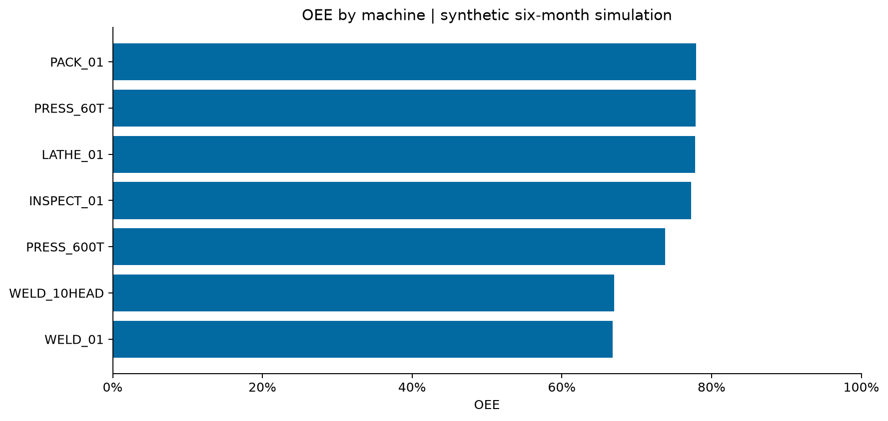
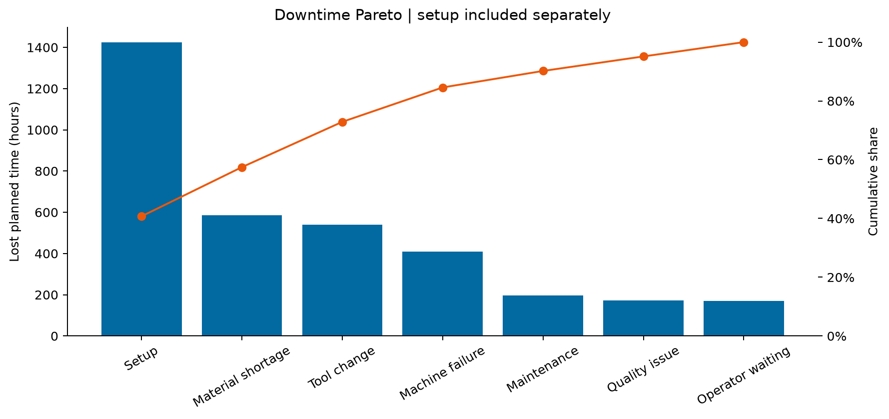
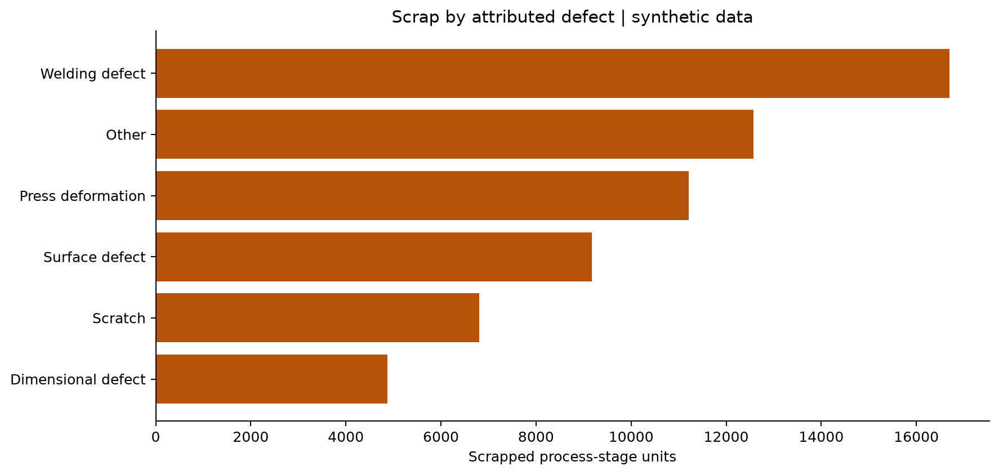
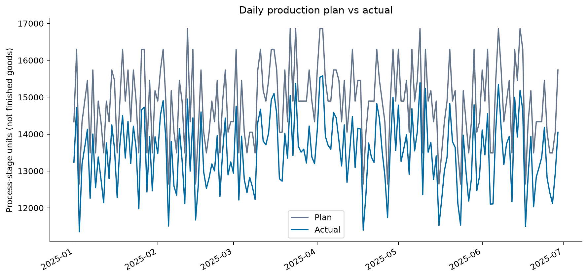

# Steel Manufacturing Operations Analytics

Portfolio project for [VaragaHaghoubians](https://github.com/VaragaHaghoubians).

## Overview

A beginner-friendly Python portfolio project simulating a small steel fabrication plant with **Pressing →
Spot Welding → Machining → Inspection → Packaging**. [Start with the learning guide](START_HERE.md). Python turns six months of
machine-shift observations into production, downtime, scrap, cycle-time, and OEE analysis.

**This project uses synthetic data and is inspired by common manufacturing workflows.
It contains no confidential company data.** It is an independent portfolio
demonstration, not a claim of real plant improvements or past employer deliverables.

## Business Problem

Identify capacity constraints, track production attainment, investigate scrap and
downtime, compare shifts, and support an operations manager's improvement priorities.
Seven notebooks connect each calculation to a business question.

## Manufacturing Process

| Operation | Machines |
|---|---|
| Pressing | PRESS_600T, PRESS_60T |
| Spot Welding | WELD_01, WELD_10HEAD |
| Machining | LATHE_01 |
| Inspection | INSPECT_01 |
| Packaging | PACK_01 |

Parallel machines are pooled when screening operation capacity. Machine-shift records
are independent: the simulator does **not** track the same parts through the process,
model WIP, or enforce transfer balances. Summing all stage outputs does not give shipped units.

## Dataset

The default generator uses seed 42, January 1–June 29, 2025 (180 calendar days), three
shifts and seven machines: **3,780 observations**. It covers Bracket, Housing, and Support
products, setup, downtime, attributed defects, material batch, grade, and team.
See [data dictionary](docs/data_dictionary.md) and [simulation design](docs/project_brief.md).

## Key KPIs

| KPI | Definition |
|---|---|
| Production attainment | Actual quantity / planned quantity |
| Scrap rate | Scrap quantity / actual quantity |
| Availability | Runtime / planned production time |
| Performance | Ideal production minutes/runtime |
| Quality | Good quantity / actual quantity |
| OEE | Availability × performance × quality |
| Cycle time | Actual-unit-weighted seconds per unit |
| Capacity screen | Good units per scheduled hour, with parallel machines pooled |

[Methodology](docs/methodology.md) defines aggregation, setup losses, and interpretation.

## Analysis

1. Understand observation grain and product mix.
2. Normalize fields and validate time, count, and capacity balances.
3. Compare plan vs. actual by day, week, shift, machine, and operation.
4. Identify scrap concentrations by defect, machine, shift, and product.
5. Analyze downtime Pareto and machine-level OEE.
6. Screen operation capacity and cycle-time variability.
7. Present management findings and recommended investigations.

## Key Findings

Exact computed findings appear in [the management summary](reports/manufacturing_summary.md)
and [metrics.json](reports/metrics.json). Welding speed loss, PRESS_600T downtime and
night-shift variability are intentionally built into the simulator. Rankings and shares
are calculated from the resulting records, rather than hard-coded as analytical results.
They support a demonstration of investigation priorities, not causal conclusions.

## Visualizations






## Tools Used

Python, Pandas, NumPy, Matplotlib and Jupyter. Openpyxl exports an Excel
workbook for optional follow-up analysis. ReportLab produces a management PDF.
No ML or predictive maintenance is required in version one.

## Repository Structure

```text
steel-manufacturing-operations-analytics/
├── README.md, START_HERE.md, requirements.txt, .gitignore, LICENSE
├── data/raw/manufacturing_data.csv
├── data/processed/       # clean data, KPI CSVs, Excel export
├── notebooks/           # seven executed business-question notebooks
├── src/                 # short Python scripts for each step
├── reports/             # figures, management summary PDF/Markdown, metrics JSON
├── docs/                # schema, methodology, recruiter guide, publishing guide
├── dashboard/README.md  # optional Excel / Power BI extension
└── tests/               # three simple calculation and data checks
```

## How to Run

Python 3.10+ required. From the extracted repository in PowerShell:
```powershell
py -3 -m venv .venv
.\.venv\Scripts\python.exe -m pip install -r requirements.txt
.\.venv\Scripts\python.exe .\src\main.py
.\.venv\Scripts\python.exe -m unittest discover -s tests -v
Start-Process .\reports\manufacturing_summary.pdf
```
Optional notebook environment:
```powershell
.\.venv\Scripts\python.exe -m pip install -r requirements-notebooks.txt
.\.venv\Scripts\python.exe -m jupyterlab
```
To change the simulation, edit `DAYS` and `SEED` near the top of `src/main.py`, then run it again.
Reports are regenerated. The capacity screen assumes the simulator's 450-minute shift;
Validate that assumption before supplying external data. Publish instructions are in
[docs/github_setup.md](docs/github_setup.md). Tests and verification details are in
[docs/validation.md](docs/validation.md).

## Limitations

Synthetic data; no real savings; independent stage observations; dominant-category
defect/downtime attribution; fixed team-shift association; simplified product mix and
no production-flow model. High output at one stage does not prove downstream throughput.
Zero-output rows are supported with undefined quality and OEE where appropriate.

## Future Improvements

Add event-level losses, product routing and WIP, validate rates with operations,
and build an Excel or Power BI dashboard after the Python analysis. Public steel-defect
analysis and predictive maintenance are separate optional projects.

## Data Sources

Primary data is generated locally by `src/generate_data.py`.
This simulated process does not merge any public dataset. See [sources and attribution](docs/data_sources.md).
MIT license covers this project code and its synthetic data, not third-party datasets.
